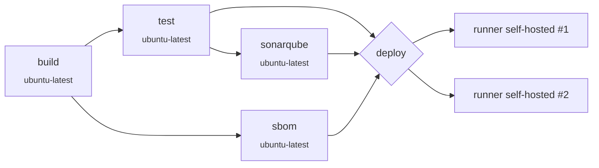

<div align="center">

# 👥 Gestión de Usuarios — AppPIN DevOps

**Sistema de gestión de usuarios con autenticación JWT**.
Pipeline DevOps completo: Backend en Node.js/Express, Frontend estático Nginx,
MySQL, IaaC con Terraform, CI/CD con GitHub Actions sobre runners self-hosted, y observabilidad con Prometheus + Grafana.

[](https://github.com/josedevops1978-design/AppPIN_devops/actions/workflows/ci.yml)


</div>

---

## 📑 Tabla de contenidos

- [Stack](#-stack)
- [Estructura del repositorio](#-estructura-del-repositorio)
- [Correr el proyecto en local](#-correr-el-proyecto-en-local)
- [Infraestructura: registrar el runner con Terraform](#-infraestructura-registrar-el-runner-self-hosted-con-terraform)
- [Workflow de CI/CD: del primer commit al deploy](#-workflow-de-cicd-del-primer-commit-al-deploy-en-el-runner)
- [Observabilidad post-deploy](#-observabilidad-post-deploy)

---

## 🧱 Stack

| Componente       | Tecnología                                                      |
|------------------|-----------------------------------------------------------------|
| Backend          | Node.js 22 + Express, JWT, bcrypt, mysql2                       |
| Frontend         | HTML/CSS/JS + Bootstrap, servido con Nginx (proxy `/api`)       |
| Base de datos    | MySQL 8.4                                                       |
| Métricas         | `prom-client` en el backend, `node-exporter`, `mysqld-exporter` |
| Observabilidad   | Prometheus + Grafana (dashboard auto-provisionado)              |
| Infra            | Docker Compose (app) + Terraform (bootstrap del runner)         |
| CI/CD            | GitHub Actions (build, test, análisis, deploy)                  |

## 🗂️ Estructura del repositorio

```
backend/                	Backend Express (API REST + métricas Prometheus)
frontend/                	Frontend estático + Nginx
database/init/           	Scripts SQL que inicializan el schema y datos de prueba
prometheus/               	Configuración de scraping de Prometheus
grafana/provisioning/    	Datasource y dashboard de Grafana (auto-provisionados)
terraform/runner-bootstrap/  	Módulo Terraform que prepara la VM y registra el runner
.github/workflows/ci.yml     	Pipeline de CI/CD
docker-compose.yml        	Orquesta todos los servicios (app + monitoreo)
```

## 🚀 Correr el proyecto en local

<details open>
<summary><strong>Pasos</strong></summary>

1. Copiar `.env.example` a `.env` y completar los valores (passwords de MySQL,
   `JWT_SECRET`, etc.).
2. Levantar todo con Docker Compose:

   ```bash
   docker compose up -d --build
   ```

3. Servicios disponibles:

   | Servicio    | URL                                                 |
   |-------------|-----------------------------------------------------|
   | Frontend    | http://localhost:3000                               |
   | Backend API | http://localhost:3001/api                           |
   | MySQL       | localhost:3307                                      |
   | Prometheus  | http://localhost:9090                               |
   | Grafana     | http://localhost:3100 (`admin`/`admin` por defecto) |

`database/init/` se ejecuta automáticamente la primera vez que se crea el
volumen de MySQL, dejando el schema y un usuario de prueba
(`admin@admin.com` / `123456`).

</details>

## ☁️ Infraestructura: registrar el runner self-hosted con Terraform

La aplicación se despliega en una VM propia (no en runners de GitHub), así
que primero hay que dejar esa VM lista y registrada como runner. 

Módulo `terraform/runner-bootstrap/`:

- Se conecta por SSH a una VM Ubuntu/Debian ya existente.
- Instala (de forma idempotente) Docker Engine, el plugin `docker compose`,
  el binario `docker-compose`, `git`, `jq` y demás dependencias.
- Descarga y configura el agente `actions-runner` de GitHub, dejándolo
  corriendo como servicio `systemd`.
- Escribe en la VM el archivo `.env` que va a usar `docker-compose.yml` al
  desplegar (`MYSQL_*`, `DB_*`, `JWT_SECRET`), para que el job de deploy no
  tenga que pasarlo en cada corrida.

<details>
<summary><strong>📋 Requisitos</strong></summary>

- La VM ya existe, es alcanzable por SSH, y el usuario SSH tiene `sudo` sin
  password (NOPASSWD).
- Un Personal Access Token de GitHub con permiso `Administration: Read and
  write` (fine-grained) o scope `repo` (classic) sobre el repositorio, para
  poder generar el registration token del runner.

</details>

<details open>
<summary><strong>⚙️ Pasos</strong></summary>

```bash
cd terraform/runner-bootstrap
cp terraform.tfvars.example terraform.tfvars
# completar terraform.tfvars: IP/usuario/password SSH, PAT de GitHub,
# nombre y labels del runner, y las credenciales de la app (.env)

terraform init
terraform apply
```

Volver a correr `terraform apply` es seguro (idempotente): si Docker o el
runner ya están instalados/registrados, el script los deja como están; y si
cambian `runner_name`/`runner_labels`/`runner_work_dir`, desregistra la
config anterior de GitHub antes de volver a registrar el runner con los
valores nuevos.

</details>

> [!TIP]
> Después de aplicar, el runner aparece en GitHub en **Settings → Actions →
> Runners** del repo con las labels definidas en `runner_labels`. Para
> distinguir un runner puntual cuando hay más de uno registrado (por ejemplo
> para usarlo en un `matrix` del workflow), conviene incluir su propio
> `runner_name` como uno de los labels.

Este módulo se corre manualmente, una sola vez por VM (y de nuevo cada vez
que cambian las credenciales de la app o la configuración del runner) — es
independiente del `docker-compose.yml` de la app, que es lo que efectivamente
corre en el runner durante el deploy.

## 🔁 Workflow de CI/CD: del primer commit al deploy en el runner

<details>
<summary><strong>🕰️ Cómo se llegó hasta acá (evolución del proyecto)</strong></summary>

1. **Desarrollo de la app** — modelo de usuario, login con JWT, middleware de
   autenticación, CRUD de usuarios en el backend, y el frontend con
   autenticación y dashboard.
2. **Dockerización** — se agregó `Dockerfile` al backend y frontend, y se
   automatizó la inicialización de MySQL vía `database/init/`.
3. **Pipeline de CI** — se agregó el workflow de GitHub Actions con lint,
   tests automatizados, análisis de seguridad de dependencias (Snyk) y
   calidad de código (SonarQube).
4. **Infraestructura como código** — se sumó Terraform para provisionar los
   contenedores de la app (etapa que luego se reemplazó por Docker Compose
   directo).
5. **Runner self-hosted** — se creó `terraform/runner-bootstrap/` para dejar
   una VM propia lista (Docker, git, etc.) y registrada como runner de
   GitHub Actions, de forma que el deploy corra en infraestructura propia en
   vez de en runners efímeros de GitHub.
6. **Deploy con Docker Compose** — el job de deploy pasó de `terraform
   apply` a `docker compose up -d --force-recreate`, actualizando el código
   en una carpeta persistente del runner (`git fetch` + `checkout -f`, ya
   que el directorio ya contiene el `.env` provisto por Terraform).
7. **Observabilidad** — se instrumentó el backend con métricas Prometheus
   (`prom-client`), se agregaron `node-exporter` (CPU/RAM de la VM) y
   `mysqld-exporter` (métricas de MySQL), y se provisionó un dashboard de
   Grafana con todo junto.

</details>

### El Pipeline (`.github/workflows/ci.yml`)

Se dispara en `push`/`pull_request` a `main`, o manualmente
(`workflow_dispatch`).



<details open>
<summary><strong>Detalle de cada job</strong></summary>

1. **`build`** *(runs-on: `ubuntu-latest`)* — instala dependencias del
   backend, corre ESLint, y construye las imágenes Docker de backend y
   frontend (sin publicarlas) para validar que el `Dockerfile` de cada uno
   compila.
2. **`test`** *(runs-on: `ubuntu-latest`, depende de `build`)* — corre la
   suite de tests con cobertura (`npm test`) y un escaneo de vulnerabilidades
   de dependencias con Snyk; sube el reporte de cobertura como artifact.
3. **`sonarqube`** *(depende de `test`)* — descarga el reporte de cobertura y
   corre el análisis estático de SonarCloud.
4. **`sbom`** *(depende de `build`)* — genera el Software Bill of Materials
   (formato CycloneDX) de backend y frontend, y lo sube como artifact.
5. **`deploy`** *(depende de `test`, `sonarqube` y `sbom`; solo en push a
   `main`)* — corre con una matriz que apunta a **cada runner self-hosted**
   registrado (identificados por sus labels únicos, ver sección anterior).
   En cada uno:
   - Clona o actualiza el código en una carpeta persistente
     (`~/pin-app-deploy`), sin tocar el `.env` que ya dejó Terraform ahí.
   - Corre `docker compose up -d --force-recreate`, que reconstruye y
     levanta todos los servicios (app + monitoreo) con las variables del
     `.env` local.

</details>

## 📊 Observabilidad post-deploy

Una vez desplegado, Prometheus scrapea el backend (`/metrics`), el
`node-exporter` (CPU/RAM de la VM) y el `mysqld-exporter` (estado y
performance de MySQL); Grafana expone un dashboard único con las tres
dimensiones para monitorear el estado de la app en el runner.
